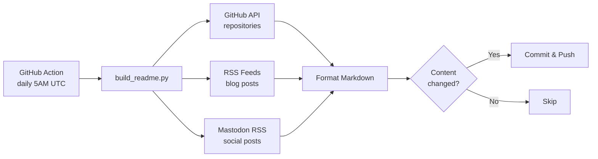

### Hi there -- ¡Hola!

<a href="mailto:ftricas@unizar.es" title="e-mail"></a>
<a href="https://www.linkedin.com/in/fernand0" title="LinkedIn"></a>
<a href="https://twitter.com/fernand0" title="Twitter/X"></a>
<a href="https://mastodon.social/@fernand0" rel="me" title="Mastodon"></a>
<a href="https://flickr.com/fernand0" title="Flickr"></a>
<a href="https://dev.to/fernand0" title="DEV.TO"></a>
<a href="https://elmundoesimperfecto.com/" rel="me" title="Homepage"></a>

# Recent Contributions
<!-- recent_releases starts -->
## repositories

* [botElectrico](https://github.com/fernand0/botElectrico),  Bot para ir mostrando si estamos en hora valle, punta, plana.... - 2026-02-27
* [fernand0](https://github.com/fernand0/fernand0),  Autoupdating readme.  - 2026-02-27
* [linkblog](https://github.com/fernand0/linkblog),  No description - 2026-02-26
* [projects](https://github.com/fernand0/projects),  Web site for projects. - 2026-02-22
* [elmundoesimperfecto-theme](https://github.com/fernand0/elmundoesimperfecto-theme),  Theme for elmundoesimperfecto.com sites - 2026-02-22
* [err-notes](https://github.com/fernand0/err-notes),  A plugin to use another-note-taking-app from errbot - 2026-02-17
* [another-note-taking-app](https://github.com/fernand0/another-note-taking-app),  Another note taking app - 2026-02-16
* [err-forward](https://github.com/fernand0/err-forward),  ErrBot plugin for forwarding messages. Since ErrBot does not allow multiple backends, we can have several ErrBot instances in different backends and allow them to communicate via a common channel. In this case we are using Slack, but other channels should be possible. - 2024-11-03
* [paseos-por-venecia](https://github.com/fernand0/paseos-por-venecia),  Una guía para dos o tres paseos por Venecia. Para uso personal por lo pronto, luego ya se verá - 2022-05-31
* [PubwichFork](https://github.com/fernand0/PubwichFork),  PubwichFork is an open-source PHP Web application that allows you to aggregate your published data from multiple websites and social services into a single HTML page. - 2016-09-03

## repositoriesContributedTo

* [www-community](https://github.com/OWASP/www-community),  OWASP Community Pages are a place where OWASP can accept community contributions for security-related content. - 2026-02-27
* [AB](https://github.com/simber72/AB),  No description - 2026-02-27
* [FIM-EINA-repositorio-material](https://github.com/ricardojrdez/FIM-EINA-repositorio-material),  Repositorio de fuentes del material de la asignatura de "Fundamentos de Informática" (Grado en Ingeniería Mecánica, EINA) - 2026-02-27
* [botse.github.io](https://github.com/botse/botse.github.io),  No description - 2026-02-26
* [click-app](https://github.com/simonw/click-app),  Cookiecutter template for creating new Click command-line tools - 2025-10-09
<!-- recent_releases ends -->

# On my blogs

<!-- blog starts -->
## [fernand0@dev.to (in English)](https://dev.to/fernand0)

* [So you would like to digitise your CD collection? (& Part 4)](https://dev.to/fernand0/so-you-would-like-to-digitise-your-cd-collection-part-4-4kem) - 2025-04-08

* [So you would like to digitise your CD collection? (Part 3)](https://dev.to/fernand0/so-you-would-like-to-digitise-your-cd-collection-part-3-505f) - 2025-03-09

* [So you would like to digitise your CD collection? (Part 2)](https://dev.to/fernand0/so-you-would-like-to-digitise-your-cd-collection-part-2-4ang) - 2025-01-31

* [So you would like to digitise your CD collection? (Part 1)](https://dev.to/fernand0/so-you-would-like-to-digitise-your-cd-collection-part-1-4i2m) - 2025-01-25

* [So, you want to publish in Bluesky with a python program?](https://dev.to/fernand0/so-you-want-to-publish-in-bluesky-with-a-python-program-3bea) - 2023-11-02

## [fernand0@GitHub (in Spanish)](https://fernand0.github.io)

* [Vibe coding y programación asistida por LLMs](https://fernand0.github.io/vibe-coding-ia/) - 2026-01-14

* [MCP y la interacción de las IAs con otros sistemas](https://fernand0.github.io/mcp-que-es/) - 2025-12-23

* [Alucinanciones de las Inteligencias Artificiales y sus consecuencias en el desarrollo de código](https://fernand0.github.io/codigo-generado-ia/) - 2025-12-16

* [Identificadores de seguridad: autorización vs autentificación](https://fernand0.github.io/objetos-identificacion/) - 2025-12-10

* [Los drones en la guerra: nuevos usos y ciberseguridad](https://fernand0.github.io/drones-guerra-electronica/) - 2025-12-02

## [Bitácora de fernand0 (in Spanish)](https://blog.elmundoesimperfecto.com)

* [En Buenos Días Aragón hablando de reconocimiento automático de contenido (ACR)](https://blog.elmundoesimperfecto.com/2026/01/29/en-buenos-dias-aragon-acr/) - 2026-01-29

* [En la sesión sobre 'Tecnología en la competencia global' del título 'Geopolítica Aplicada a la Empresa'](https://blog.elmundoesimperfecto.com/2026/01/28/tecnologia-geopolitica/) - 2026-01-28

* [Las IAs como consejeras o ayudantes](https://blog.elmundoesimperfecto.com/2026/01/14/ia-gobiernos-usos/) - 2026-01-14

* [Buscando sitios cómodos en internet](https://blog.elmundoesimperfecto.com/2025/12/23/web-acogedora/) - 2025-12-23

* [Las inteligencias artificiales, la web abierta y nosotros](https://blog.elmundoesimperfecto.com/2025/12/16/fin-web-ia/) - 2025-12-16
<!-- blog ends -->

# Links published in my Mastodon and other social networks.

<!-- mastodon starts -->
## [fernand0@mastodon.social](https://mastodon.social/@fernand0)
* [Gary Vaynerchuk says Gen Z mental health was ruined by this common family issue—so stop blaming social media <a href="https://www.fastcompany.com/91494605/gary-v-vaynerchuk-says-gen-z-teen-mental-health-wasnt-ruined-by-social-media-parenting" rel="nofollow noopener" target="_blank">https://www.fastcompany.com/91494605/gary-v-vaynerchuk-says-gen-z-teen-mental-health-wasnt-ruined-by-social-media-parenting</a>](https://mastodon.social/@fernand0/116144023749286645) - 2026-02-27
* [Madrid 2026 - RootedCON  <a href="https://rootedcon.com/agenda/madrid-2026/" rel="nofollow noopener" target="_blank">https://rootedcon.com/agenda/madrid-2026/</a>](https://mastodon.social/@fernand0/116143692801984372) - 2026-02-27
* [Mezquita azul y hotel <a href="https://www.flickr.com/photos/fernand0/55109723133/" rel="nofollow noopener" target="_blank">https://www.flickr.com/photos/fernand0/55109723133/</a>](https://mastodon.social/@fernand0/116143549299867818) - 2026-02-27
* [Code.org President Steps Down Citing 'Upending' of CS By AI - Slashdot <a href="https://news.slashdot.org/story/26/02/21/1932253/codeorg-president-steps-down-citing-upending-of-cs-by-ai" rel="nofollow noopener" target="_blank">https://news.slashdot.org/story/26/02/21/1932253/codeorg-president-steps-down-citing-upending-of-cs-by-ai</a>](https://mastodon.social/@fernand0/116143470766360702) - 2026-02-27
* [Montón. <a href="https://asavecesunafoto.wordpress.com/2026/02/27/monton/" rel="nofollow noopener" target="_blank">https://asavecesunafoto.wordpress.com/2026/02/27/monton/</a>](https://mastodon.social/@fernand0/116143444903355191) - 2026-02-27
<!-- mastodon ends -->

---

## 🚀 Use This Yourself

This README auto-updates daily with your GitHub activity, blog posts, and social media links.

### Setup Instructions

**1. Fork this repository**

```bash
# Or use the GitHub UI to fork
git clone https://github.com/YOUR_USERNAME/YOUR_USERNAME.git
cd YOUR_USERNAME
```

**2. Create a GitHub Personal Access Token**

- Go to [GitHub Settings → Tokens](https://github.com/settings/tokens)
- Create a new token with scope: `public_repo` (or `repo` for private repos)
- Copy the token (starts with `ghp_`)

**3. Add the token as a secret**

- In your fork: **Settings → Secrets and variables → Actions**
- Click **New repository secret**
- Name: `FERNAND0_TOKEN`
- Value: Your token from step 2

**4. Customize the configuration**

Copy and edit [`config.yaml`](config.yaml):

```yaml
github:
  username: "YOUR_USERNAME"
  token_env_var: "FERNAND0_TOKEN"

readme:
  file: "README.md"
  max_blog_entries: 5

blogs:
  "Your Blog Name":
    feed_url: "https://yourblog.com/feed.xml"
    display_url: "https://yourblog.com"

mastodon:
  username: "yourusername"
  server: "mastodon.social"  # or your instance
```

**5. Update your social links**

Edit the badge links at the top of [`README.md`](README.md) with your profiles.

**6. Enable the workflow**

The GitHub Action runs daily at 5:00 AM UTC. To trigger manually:

- Go to **Actions → Build README → Run workflow**

### Local Testing

```bash
# Install dependencies
pip install -e ".[dev]"

# Test feed fetching (no GitHub API, no README write)
python build_readme.py --test

# Run full update (requires FERNAND0_TOKEN)
export FERNAND0_TOKEN="ghp_..."
python build_readme.py

# Run tests
pytest

# Run linters
ruff check .
mypy build_readme.py
```

### How It Works



### Markers in README

The script looks for these HTML comments to inject content:

| Marker | Content |
|--------|---------|
| `<!-- recent_releases starts -->` | GitHub repositories |
| `<!-- blog starts -->` | Blog posts from RSS feeds |
| `<!-- mastodon starts -->` | Mastodon social posts |

Add these markers to your README where you want content to appear.

---

*This README is auto-generated using a workflow inspired by [Simon Willison](https://simonwillison.net/2020/Jul/10/self-updating-profile-readme/).*
