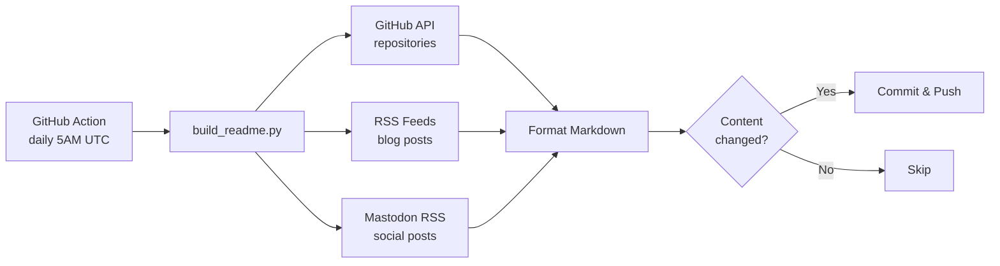

# Use This Yourself

This README auto-updates daily with your GitHub activity, blog posts, and social media links.

## Setup Instructions

**1. Fork this repository**

```bash
# Or use the GitHub UI to fork
git clone https://github.com/YOUR_USERNAME/YOUR_USERNAME.git
cd YOUR_USERNAME
```

**2. Create a GitHub Personal Access Token**

- Go to [GitHub Settings → Tokens](https://github.com/settings/tokens)
- Create a new token with scope: `public_repo` (or `repo` for private repos)
- Copy the token (starts with `ghp_`)

**3. Add the token as a secret**

- In your fork: **Settings → Secrets and variables → Actions**
- Click **New repository secret**
- Name: `FERNAND0_TOKEN`
- Value: Your token from step 2

**4. Customize the configuration**

Copy and edit [`config.yaml`](config.yaml):

```yaml
github:
  username: "YOUR_USERNAME"
  token_env_var: "FERNAND0_TOKEN"

readme:
  file: "README.md"
  max_blog_entries: 5

blogs:
  "Your Blog Name":
    feed_url: "https://yourblog.com/feed.xml"
    display_url: "https://yourblog.com"

mastodon:
  username: "yourusername"
  server: "mastodon.social"  # or your instance
```

**5. Update your social links**

Edit the badge links at the top of [`README.md`](README.md) with your profiles.

**6. Enable the workflow**

The GitHub Action runs daily at 5:00 AM UTC. To trigger manually:

- Go to **Actions → Build README → Run workflow**

## Local Testing

```bash
# Install dependencies
pip install -e ".[dev]"

# Test feed fetching (no GitHub API, no README write)
python build_readme.py --test

# Run full update (requires FERNAND0_TOKEN)
export FERNAND0_TOKEN="ghp_..."
python build_readme.py

# Run tests
pytest

# Run linters
ruff check .
mypy build_readme.py
```

## How It Works



## Markers in README

The script looks for these HTML comments to inject content:

| Marker | Content |
|--------|---------|
| `<!-- recent_releases starts -->` | GitHub repositories |
| `<!-- blog starts -->` | Blog posts from RSS feeds |
| `<!-- mastodon starts -->` | Mastodon social posts |

Add these markers to your README where you want content to appear.
